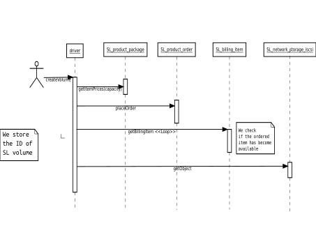
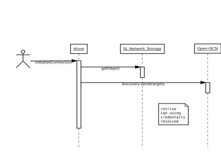

.. Cinder SoftLayer Driver documentation master file, created by
   sphinx-quickstart on Fri Dec 27 11:28:41 2013.
   You can adapt this file completely to your liking, but it should at least
   contain the root `toctree` directive.

Cinder SoftLayer Driver
=======================

The block storage service Cinder in OpenStack allows administrator to choose the back-end service which is used to create volumes on. So, the adminitrator use the driver depending on the infrastructure she has. The SoftLayer Driver for Cinder supports the Cinder Driver API and creates volumes and snapshots in SoftLayer. This allows user to use Cinder to create volumes in SoftLayer. More information about driver API can be found `here <https://github.com/openstack/cinder/blob/master/doc/source/devref/drivers.rst>`_.

Using SoftLayer Driver
======================

To use SoftLayer Driver you need to change the ``volume_driver`` value in ``/etc/cinder/cinder.conf`` on the Cinder Volume Node to following:

::

    volume_driver=cinder.volume.drivers.softlayer.iscsi.SoftLayerISCSIDriver

The next thing to do is provide SoftLayer API access credentials:

::

    softlayer_api_uesrname=<YOUR_SL_USERNAME>
    softlayer_api_key=<YOUR_SL_KEY>

Lastly you need to specify the datacenter in which you want the volumes to be created.

::

    softlayer_datacenter=<Interger ID of the Datacenter>

Once all these values are configured the SoftLayer Driver is ready to be started. Start the Cinder Volume service by using:

::

    sudo service openstack-cinder-volume start

Design
======

SoftLayer Driver works with the SoftLayer Services to complete calls. This document will describe the major scenarios and corousponding calls to SoftLayer services.

Create Volume
^^^^^^^^^^^^^

The Create Volume method of the driver is works with ``Product_Package``, ``Product_Order``, ``Billing_Item`` and ``Network_Storage_Iscsi`` services from SoftLayer.

The driver first tries to find if there are any ``Item Prices`` available for the given volume size. If there isn't any then it throws ``VolumeBackendAPIException`` since it cannot allocate volume of the given size in SoftLayer. If it receives the item prices, it sorts them on recurring charges from lowest to highest. And tries to place order using them. 

Attach Volume
^^^^^^^^^^^^^

When the driver is asked to give details so that ``Nova`` service can attach the volume to an instance. The SoftLayer driver figures the IQN (iSCSI Qualified Name) using the credentials given by the SoftLayer:

The IQN is discovered using the iSCSI Initiator tools available on the host machine.

Driver
======

The SoftLayer Driver is implemented in following class. As per the `requirement <https://github.com/openstack/cinder/blob/master/doc/source/devref/drivers.rst>`_. the driver is compatible with Havana release of the OpenStack.

.. autoclass:: cinder.volume.drivers.softlayer.iscsi.SoftLayerISCSIDriver
    :members:

.. toctree::
   :maxdepth: 2

Indices and tables
==================

* :ref:`genindex`
* :ref:`modindex`
* :ref:`search`

