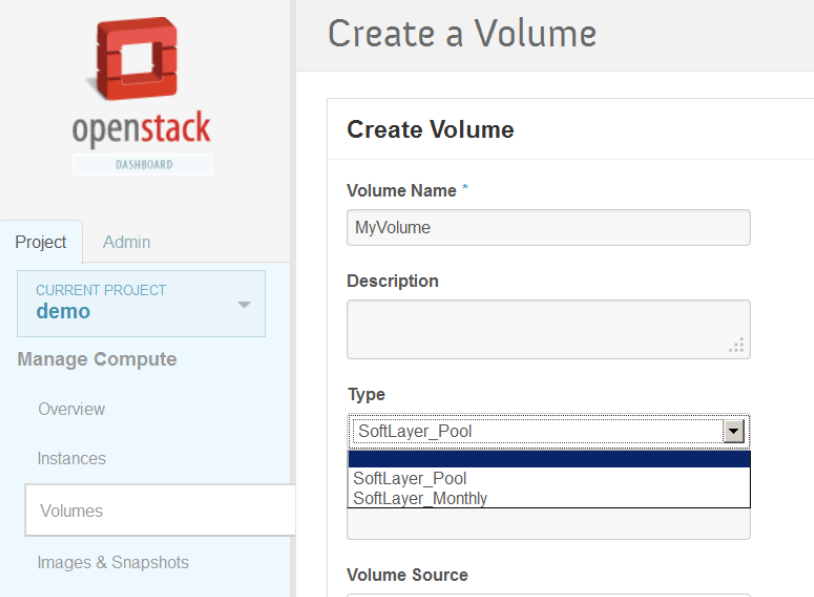

.. SoftLayer Cinder Driver

SoftLayer Cinder Driver
=======================

The OpenStack Block Storage Service, code named Cinder, allows users to choose one or more back-ends to create block storages. Since each back-end has different way to create/access the storage, back-ends are managed using drivers, for each storage technology or service there can be a separate driver. Adminitrator choose drivers depending on the infrastructure she has. More information about driver API can be found `here <https://github.com/openstack/cinder/blob/master/doc/source/devref/drivers.rst>`_. The SoftLayer Cinder Driver is one such driver, it allows user to use SoftLayer's block storage service from within OpenStack. This means user can create local storages as well as storages on SoftLayer.

Installation and Configuration
==============================

Installation
------------

Copy the *SoftLayerOpenStack-x.x.x.tar.gz* on the *cinder volume node*. Then run following command to install it:

.. code-block:: bash

    $ sudo pip install <location of SoftLayerOpenStack-x.x.x.tar.gz>

The SoftLayer iSCSI targets requires *CHAP* authentication to discover, this requires the driver to change */etc/iscsi/iscsid.conf* file using *sed*. For this reason, before configuring Cinder to use SoftLayer Cinder Driver, you'll need to run following command.

.. code-block:: bash

    $ # NOTE: before you run the command
    $ # check '/etc/cinder/rootwrap.d/volume.filters' exists, if not check cinder.conf for rootwrap location
    $ echo "sed:CommandFilter,/bin/sed,root" | sudo tee -a /etc/cinder/rootwrap.d/volume.filters

The SoftLayer Cinder Driver can now be configured to be used by cinder volume component.

Single Back-end Configuration
-----------------------------

(NOTE: Following is just an example configuration, to understand what each configuration variable means and its posible values refere to :ref:`complete-conf`)

To make *cinder volume* component use SoftLayer Cinder Driver you need to change the *volume_driver* value in */etc/cinder/cinder.conf*

.. code-block:: python

    volume_driver=slos.cinder.driver.iscsi.SoftLayerISCSIDriver

The next thing to do is provide SoftLayer API access credentials in *DEFAULT* section:

.. code-block:: python

    sl_username=<YOUR_SL_USERNAME>
    sl_api_key=<YOUR_SL_KEY>

Optionally you need to specify the datacenter in which you want the volumes to be created, if not specified default value will be *dal05*

.. code-block:: python

    sl_datacenter=<datanceter_name> # default: dal05

Pool Driver
'''''''''''

If you want to use existing storages for every create request, you can use the alternative driver called `pool driver`. This driver can be configured in following way.

.. code-block:: python

    volume_driver=slos.cinder.driver.iscsi.SoftLayerISCSIPoolDriver

This will make the *cinder volume* component to use `pool driver`. It would need few more configuration apart from *sl_username*,  *sl_api_key* and *sl_datacenter*:

.. code-block:: python

    sl_pool_real_order=True # default False
    sl_pool_volume_clear=shred # see details below

The *sl_pool_real_order* instructs driver whether to place new order when all iSCSI storages are being used by the pool driver. Default value for this is *False*. If this *sl_pool_real_order* is *False* the creation of new volume will fail in case all the volumes in the pool are used. If *sl_pool_real_order* is *True*, then, it will place new order of the volume in case all volumes are being used by the cinder.

The *sl_pool_volume_clear* instructs driver what to do when volume is deleted from the pool. It assumes one of the three values: *zero* (default), *shred* or *none*. *zero* will fill the volume with zero. While the *shred* will use the `shred <http://en.wikipedia.org/wiki/Shred_%28Unix%29>`_ command from Unix to erase the contents of the volume. If *none* is specified the driver will keep the contents of the volume intact.

Enabling the new configuration
''''''''''''''''''''''''''''''

Once you choosed on of the *SoftLayerISCSIDriver* and *SoftLayerISCSIPoolDriver* and configured it, cinder volume service is ready to start.

.. code-block:: bash

    $ sudo service openstack-cinder-volume restart

.. _multi-backend-config:

You can check the Cinder volume logs to see if you got any driver related errors while initializing (driver should be able to communicate with SoftLayer services).

Multiple Back-end Configuration
-------------------------------

The multiple back-end configuration can be used to give control on which back-end the new volume should get created. A cinder installation can have support to multiple backends such as local LVM, SoftLayer's cinder driver or pool driver. So that user can choose which type of backend to use for a particular volume. Following section gives details about how can administrators configure cinder to use both types of SoftLayer cinder drivers.

.. _config:

Configuration
'''''''''''''
.. code-block:: ini
    :linenos:
    :emphasize-lines: 4,10,7,16

    enabled_backends=sl_driver-monthly,sl_driver-pool
    scheduler_driver=cinder.scheduler.filter_scheduler.FilterScheduler 
    [sl_driver-monthly]
    volume_driver=slos.cinder.driver.iscsi.SoftLayerISCSIDriver
    sl_username=<YOUR_SL_USERNAME>
    sl_api_key=<YOUR_SL_KEY>
    volume_backend_name=SoftLayer_iSCSI_Monthly
    sl_datacenter=dal05
    [sl_driver-pool]
    volume_driver=slos.cinder.driver.iscsi.SoftLayerISCSIPoolDriver
    sl_username=<YOUR_SL_USERNAME>
    sl_api_key=<YOUR_SL_KEY>
    sl_pool_real_order=True 
    sl_pool_volume_clear=zero 
    sl_datacenter=sjc01
    volume_backend_name=SoftLayer_iSCSI_Pool
    
Line number 1 instructs cinder to use multiple backends and which config sections should be refered for the enabled backends. Line number 3 and 9 specifies each backend. Note the lines 4 and 10 specifies which driver to use for the backend. While the line number 7 and 16 specifies what is the name of the backend.  Please note each backend configuration is separate, you can configure each driver to use separate account, for example. Finally, line number 2 updates the *scheduler_driver*, this is compulsary to use multibackend capabilities of cinder.

Once configured restart the service using *sudo service openstack-cinder-volume restart*.

Volume Types
''''''''''''

To define volumes types you'll need *admin* credentials to the OpenStack. Source your admin credentials and run following commands.

.. code-block:: bash
    :linenos:

    $ cinder type-create SoftLayer_Monthly 
    $ cinder type-create SoftLayer_Pool
    $ cinder type-key SoftLayer_Monthly set volume_backend_name=SoftLayer_iSCSI_Monthly
    $ cinder type-key SoftLayer_Pool set volume_backend_name=SoftLayer_iSCSI_Pool

Line number 1 and 2 are creating volume types, while line number 3 and 4 are mapping the volume types with the backend. Lines 3 and 4 are refering to *volume_backend_name* which are configured in :ref:`config`.

.. _complete-conf:

Complete Configuration Reference
--------------------------------

This section explains all configuration settings available for SoftLayer Cinder Driver.

*sl_username*
    SoftLayer username to use when invoking SoftLayer API. No default values for this variable.

*sl_api_key*
    API Key to be used when invoking SoftLayer API. No default values for this variable.

*sl_pool_real_order*
    A boolean only applicable if *pool driver* is used. What to do when pool is fully being used. Should new Order be placed? Default value is *False*, the driver will raise an error if size is not supported by the SoftLayer iSCSI storage service. 

*sl_pool_volume_clear*
    Only applicable when *pool driver* is used. Decides how to erase contents of the volume when deleted. Possible values: *zero*, *shred* or *none*. *zero* will fill the volume up with *0* using */dev/zero*. *shred* will use the Unix *shred* command to erase the contets of the volume. *none* will not do anything to the volume all contents of the volume will remain intact. Default value is *zero*.

*sl_datacenter*
    On which datacenter new volumes should be created. This should be full name of the datacenter, e.g. *dal05*. Default value is *dal05*

*sl_order_snap_space*
    A boolean, to decide whether driver should automatically order space when it is not able to create snapshot due to insufficient space. Default value is *True*.

*sl_vol_order_ceil*
    A boolean. Decideds should the driver order the first smallest bigger volume if size is not supported. Default value is *False*.

*sl_use_name*
    How should driver use SoftLayer volume's name. Possible values: *none*, *metadata*, *display_name*. *'none'=* ignore SL's display name, *'metadata'=* update volume metadata with key *'SL_iSCSI_Name'*, or *'display_name'* = update volume's display name with SL's display name. Default value is *none*.

*sl_snap_space_active_retry*
    Retry count to check if the ordered snapshot space is available. Default values is *10*.

*sl_snap_space_active_wait*
    Sleep wait between retry to check snap space if is active

*sl_vol_active_wait*
    Sleep wait between retry to check volume if is active   
    
*sl_vol_active_retry*
    Retry count to check if the ordered volume is available. Default values is *10*.

Using SoftLayer Cinder Driver
=============================

Once Cinder driver installed and configured properly, Cinder API can be used as is to create volumes on the SoftLayer and attaching them to your instances in OpenStack. This driver however is limited by the volume sizes provided by the SoftLayer, meaning if you try to create a volume of size (let's say) 5 GB and if it is not supported by SoftLayer then Cinder volume will go in error state *unless* configuration has *sl_vol_order_ceil* set to be *True*, in which case the driver will attempt to find first bigger volume.

Single Back-end Use
-------------------

If you have configured cinder to use single back-end then most there aren't any special instructions that applies to the way you interact with Cinder. 

Createting New Volumes
''''''''''''''''''''''

Creating volumes remains unchanged for `SoftLayerISCSIDriver` .

.. code-block:: bash

    $ cinder create 20 # orders a new volume on SoftLayer and makes it visible in OpenStack

Similarly the instructions for creating new volumes using Horizon doesn't change for SoftLayer Cinder Driver configured to use `SoftLayerISCSIDriver`.
    
Reusing existing volumes (pool strategy)
''''''''''''''''''''''''''''''''''''''''

If you have configured the driver to use then it will reuse the existing volumes in your account.

.. code-block:: bash

    $ cinder create 200 # If there is an unallocated volume in the pool it will be used

If there is no single volume in the pool which is unallocated for the given size then, if the driver has *sl_pool_real_order=True* in the configuration then new order is placed for the given size. Otherwise the volume goes in the error state (because, driver cannot place order).

If you want a specific volume from the pool to be used then you can specify:

.. code-block:: bash

    $ cinder create 200 --metadata softlayer_volume_id=<iSCSI Storage ID>

This command will force the driver to use iSCSI storage from the account with id *<iSCSI Storage ID>*. You can have other metadata as well along with the mentioned one. 

Deletion of volumes
'''''''''''''''''''

If you are not reusing existing volume the volumes ordered will be cancelled immediately. If however, you are reusing the existing volume using the metadata value mentioned above then, the driver will not cancel the volume. 

Snapshots
'''''''''

Snapshot creation remains the same accros driver types. In both the cases it will order new snapshot space and create snapshots. If you don't want to order new snapshot space for the volumes then you can disable it by:

.. code-block:: python

   sl_order_snap_space=False # default is True 

Multi Back-end Use
------------------

If you have configured the driver as described in :ref:`config` then you can use the following instructions to create volumes in specific way.

.. code-block:: bash

    $ cinder create --volume-type SoftLayer_Pool 200
    $ cinder create --volume-type SoftLayer_Monthly 200

The first command will use the iSCSI pool to allocate the volume, while the other will order new volume of size 200. Interacting with Horizon doesn't change, you just have to select appropriate volume type from the drop down when you get the create volume pop-up.

You can also use other features of the Cinder such as copying an image into volume, copying volume into image. 

Known Issues
============

Right now if you try to clone an existing volume, the driver will take some time. This is because there is no direct support from the SoftLayer API to clone a volume.

